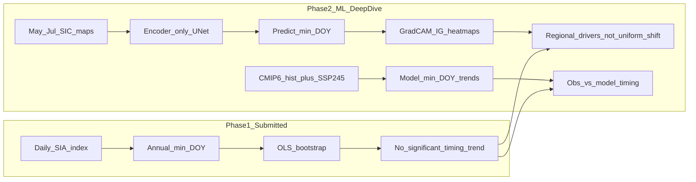

# Phase 2: Explainable ML Deep Dive on Sea-Ice Timing (Revised June 2026)

## Constraint (non-negotiable)

The submitted [one_pager.tex](report/one_pager.tex) is locked. Phase 2 **extends** it; it does not replace it.

| Locked claim | Value |
|---|---|
| Arctic min DOY trend | −0.08 d yr⁻¹, *p* = 0.65 (not significant) |
| Antarctic AFIN proxy trend | +29.45 d yr⁻¹, *p* = 0.21 (not significant) |
| Headline | Magnitude loss ≠ calendar shift |

Phase 2 answers a **new sub-question**: *Why is minimum timing noisy, and which spatial patterns drive early vs late years?*

None of the revisions below threaten these locked claims.

---

## Scientific framing (report narrative)



**Story arc for long report + presentation:**
1. Phase 1: pan-hemispheric timing shows no robust shift (one-pager figure).
2. Phase 2: spatial DL shows timing variability is **regionally structured** (MIZ, Beaufort, Kara)—weather-driven redistribution, not a uniform calendar advance. Cite GRL 2025 work on amplified regional air temperatures driving increased Arctic SIA variability.
3. CMIP6: do models exhibit timing trends where observations do not? (hist + SSP2-4.5 splice for 1979–2020).
4. Synthesis: indicator choice matters; scalar DOY trends underpowered vs spatially resolved analysis.

This is **not** a literature survey—it requires training, evaluation, and attribution experiments.

---

## Anchor papers (2022–2025, verified)

| Paper | Role in your project |
|---|---|
| **Joakimsen et al. (2024)** — gradient-based XAI on IceNet (*IEEE GRSL*) | Direct template for spatial attribution heat maps |
| **Li et al. (2024)** — SIFNet + LRP-*z* for daily SIC (*IEEE TGRS*, Vol. 62) | MIZ-weighted loss; LRP attribution; teleconnection-aware design |
| **Palerme et al. (2024)** — short-term SIC post-processing (*The Cryosphere*, 18, 2161–2183) | **Attention Residual U-Net** (not plain U-Net) — cite for encoder block design |
| **Ren et al. (2025)** — SICNetseason V1.0 (*GMD*, 18, 2665) | Qualitative positioning only (see Issue 4 below) |
| **Gregory et al. (2024)** — CNN online SIC bias correction (*GRL*) | CMIP6 spatial bias framing |

### Additional references (June 2026)

| Paper | Role |
|---|---|
| **GRL 2025** — *Increased Arctic Sea-Ice Variability Is Associated With Amplified Air Temperatures* | Mechanistic context for Grad-CAM findings in Beaufort/Kara/MIZ |
| **IceCT (2025)** — Mixture-of-Experts seasonal Arctic SIC+SIT (*AGU*) | Architecture appendix: field direction vs your encoder-only MVP for interpretability |
| **WMO 2025 / EUMETSAT OSI-SAF** — State of the Global Climate | Antarctic four consecutive record-low minima (2021–2024); Arctic ~14% per decade extent decline |

**Foundation models note:** Replace arXiv:2502.14088 VLM reference with **IceCT (2025)** for the optional architecture appendix slide. VLMs remain immature for EO regression; core contribution stays **encoder + Captum**.

---

## Phase 2 ML design (revised)

### Task
Predict **annual Arctic minimum DOY** from **pre-melt SIC spatial fields** (clean predictive framing).

### Input channels (Issue 1 fix — target leakage)

**Primary (prediction):** Stacked monthly SIC maps for **May–July** (3 channels, pre-melt conditioning). Aligns with SICNetseason spring-initialization logic (Ren et al. 2025).

**Diagnostic ablation (attribution-only, separate run):** Jul–Aug SIC (2 channels) + early-September mean (Sep 1–7, channel 3). Clearly labelled as *diagnostic*, not operational forecast. Methods sentence:

> *"The Sep channel represents the SIC state in the first week of September; the target DOY always falls within the remainder of September, ensuring temporal separation."*

- **Grid:** NSIDC CDRv6 G02202, Arctic polar stereographic, 25 km (~160×160 pixels for 60–90°N cap).
- **Target:** Observed min DOY from [run_analysis.py](scripts/run_analysis.py) → `results/tables/arctic_annual_minimum_doy_osisaf_sia.csv`.

### Model architecture (Issue 2 fix — scalar regression)

**Encoder-only U-Net** (not full encode–decode):
- Contracting path using **Attention Residual U-Net blocks** (Palerme et al. 2024 design).
- **Global Average Pooling** at bottleneck → 2 FC layers → scalar min-DOY output.
- ~500K–1M params (not ~2M). No decoder — decoder is for dense SIC output, not scalar regression.
- Attention gates provide built-in spatial weighting, aiding Grad-CAM interpretability.

### Training and evaluation

- **LOYO CV:** 1979–2020 training pool; hold-out test **2021–2025** (verify CDRv6 NRT for 2025; 2025 min was Sep 10, ~5.07 M km²).
- **Pre/post-2007 diagnostic (Issue 5):** Report LOYO MAE split 1979–2006 vs 2007–2020 in `evaluate.py`. If post-2007 errors are larger, discuss non-stationarity / first-year ice dominance in Discussion.

### Baselines (Issue 3 fix — no circular baseline)

| Baseline | Description |
|---|---|
| (i) Climatological mean DOY | Mean of all training-year DOYs |
| (ii) Linear trend extrapolation | OLS trend on prior-year DOY (Phase 1 extension) |
| (iii) Aug 31 hemispheric SIA (scalar) | Linear regression of Aug 31 SIA → min DOY |
| (iv) Persistence of prior-year DOY | Simplest auto-regressive baseline |

**Removed:** "SIA at minimum" — requires knowing min date (circular).

### Metrics
MAE (days), RMSE, Pearson *r*; compare all baselines on LOYO and hold-out test.

### SICNetseason positioning (Issue 4 fix)

Qualitative only — no metric comparison:

> *"SICNetseason (Ren et al., 2025) achieves >20% ACC improvement in 4–5 month lead September SIE prediction using spring SIT as a key predictor. Our work addresses a complementary question — not how much ice exists at the minimum, but when the minimum occurs — and uses melt-season spatial patterns as predictors rather than SIT."*

### Heat maps (core deliverable)

Using **Captum** on the trained encoder:
- **Grad-CAM** on encoder layers → spatial heat maps (Joakimsen 2024 style).
- **Integrated Gradients** per input month (**May/Jun/Jul** for primary model) → channel-importance bar chart.
- **Case studies:** earliest vs latest min-DOY years (e.g. 2012 vs 1990); link Beaufort 2025 warm-air incursion to regional attribution if data available.
- Cite GRL 2025 amplified air-temperature variability as mechanistic context when attribution peaks regionally.

Expected finding (supports one-pager): attribution in **MIZ and regional pockets**, not pan-Arctic uniform pattern.

### CMIP6 timing comparison (Issues 6 + course alignment)

From [hint.md](docs/hint.md):
- Models: **MPI-ESM1-2-LR**, **IPSL-CM6A-LR**, **CanESM5** (or course equivalents).
- **Splice historical (to 2014) + SSP2-4.5 (2015–2020)** for continuous 1979–2020 window (`cmip6_timing.py`).
- Compute annual min DOY per model (same melt window as obs).
- Plot obs vs model min-DOY trends; overlay ensemble internal variability.
- Discussion note: models with significant timing trends where obs lack them may overestimate forced timing shifts (cf. Frankignoul et al. 2024, *J. Climate*, CMIP6 September SIC biases).

**Practical:** Queue CMIP6 downloads on **ESGF DKRZ** (`esgf-data.dkrz.de`) in **W1 parallel** with gridded SIC — ESGF instability is a known risk.

### Antarctic (Issue 7 fix — clarify n=9)

**No DL for Antarctic.** Clarify explicitly:

> *"The Antarctic timing analysis is limited to n=9 years (2010–2018) of AFIN manual transect proxy data at Atka Bay (Neumayer III), precluding neural network approaches. OSI-SAF Southern Hemisphere minimum DOY (1979–present) is used only for contextual annotation."*

Qualitative depth:
- AFIN survey calendar plot; 2013/2016 iceberg-blocking annotations (Arndt et al. 2020).
- WMO 2025 context: four consecutive record-low Antarctic minima (2021–2024).
- Contrast fast-ice proxy limitations vs pan-hemispheric pack ice.

---

## Data pipeline (CDRv6 update)

```yaml
# config.yaml additions
data:
  nsidc_cdr_version: 6          # G02202 Version 6 (was implicitly v4)
  arctic_subset_years: [1979, 2024]
  test_years: [2021, 2025]      # verify NRT coverage for 2025
ml:
  input_channels: [may, jun, jul]   # primary prediction
  diagnostic_channels: [jul, aug, early_sep]  # attribution ablation
  grid_resolution_km: 25
  cmip6_models: [MPI-ESM1-2-LR, IPSL-CM6A-LR, CanESM5]
  cmip6_scenarios: [historical, ssp245]
```

| Dataset | Use | Size |
|---|---|---|
| NSIDC CDRv6 G02202 monthly SIC (Arctic, 1979–2024/25) | U-Net input | ~1–3 GB |
| CMIP6 NH SIA (3 models, hist + SSP2-4.5) | Timing comparison | <100 MB |
| ERA5 monthly 2m-T (optional) | Ablation only if time | ~500 MB |

Reuse OSI SAF daily index to validate gridded aggregation matches Phase 1.

**2025 note:** Arctic minimum Sep 10, 2025 (~5.07 M km², 14th lowest); Beaufort warm-air incursion through Aug 2025 — useful case-study year if NRT data available.

---

## Repository changes (4-week MVP)

```
ml/
  dataset.py          # Gridded SIC → tensor + DOY labels (May-Jul primary)
  model.py            # Encoder-only Attention Residual U-Net + GAP + FC head
  train.py            # LOYO training loop
  attribution.py      # Grad-CAM + Integrated Gradients (Captum)
  evaluate.py         # Metrics vs baselines + pre/post-2007 MAE split
scripts/
  download_gridded.py # NSIDC CDRv6 G02202
  download_cmip6.py   # ESGF hist + SSP2-4.5 (start W1)
  run_ml_phase2.py    # Orchestrator
  cmip6_timing.py     # Model min-DOY trends (spliced scenarios)
  sensitivity_analysis.py  # Phase 1 extensions (amount vs timing, Aug31 baseline)
report/
  full_report.tex
  slides.tex
docs/
  PHASE2_ML.md        # ML methods (leakage fixes, encoder design documented)
```

### Extend existing code
- [config.yaml](config.yaml): `data:` and `ml:` blocks as above.
- [requirements.txt](requirements.txt): `torch`, `captum`, `torchvision`, `netcdf4`, `cartopy`.
- [scripts/run_analysis.py](scripts/run_analysis.py): Phase 1 entry point unchanged.
- [docs/ML_NOTES.md](docs/ML_NOTES.md): revised framing (see below).

---

## Figure list (revised)

| # | Figure | Section | Status |
|---|---|---|---|
| 1 | `polar_ice_timing_comparison.png` | Phase 1 | Existing (locked) |
| 2 | Arctic SIA at minimum vs min-DOY dual-axis decoupling | Phase 1 ext. | New |
| 3 | Aug 31 SIA vs min-DOY scatter (baseline context) | Phase 1 ext. | New |
| 4 | Encoder predicted vs observed min-DOY (LOYO + test 2021–2025) | Phase 2 ML | New |
| 5 | **Grad-CAM heat maps** — earliest (2012) vs latest (1990) min-DOY years | Phase 2 XAI | Core deliverable |
| 6 | Integrated Gradients — May/Jun/Jul channel importance | Phase 2 XAI | Core deliverable |
| 7 | CMIP6 obs vs model min-DOY trends, 3 models + ensemble spread | Model context | New |
| 8 | Antarctic AFIN calendar + 2013/2016 + four record-low minima (WMO 2025) | Antarctic | Updated |

**Presentation:** figures 1, 2, 5, 7, 8 (~10 min).

---

## 4-week timeline (June–July 2026)

| Week | Work | Deliverable | Flag |
|---|---|---|---|
| **W1** | CDRv6 download; **CMIP6 ESGF queue (DKRZ, parallel)**; decoupling + Aug31 figures; report skeleton | `download_gridded.py`, `download_cmip6.py`, Figs 2–3, `full_report.tex` outline | Start CMIP6 early |
| **W2** | Encoder-only U-Net training (LOYO); 4 baselines; pre/post-2007 MAE | `ml/train.py`, Fig 4, metrics table | ~500K params, fast convergence |
| **W3** | Captum attribution; diagnostic Jul-Aug-earlySep ablation; CMIP6 timing splice | Figs 5–7, `cmip6_timing.py` | ESGF may still be downloading |
| **W4** | Antarctic plots + WMO context; Discussion; Beamer slides | Fig 8, `slides.tex`, final PDF | |

---

## Risks and mitigations (updated)

| Risk | Mitigation |
|---|---|
| Target leakage (Sep SIC → Sep min DOY) | May–Jul primary input; diagnostic ablation labelled separately |
| U-Net decoder inappropriate for scalar | Encoder-only + GAP + FC head |
| Circular baseline | Aug 31 SIA scalar baseline replaces SIA-at-minimum |
| 47 samples → overfitting | LOYO CV; ~500K params; 4 strong baselines |
| Post-2007 non-stationarity | Pre/post-2007 MAE split table in `evaluate.py` |
| CMIP6 hist ends 2014 | Splice historical + SSP2-4.5 for 1979–2020 |
| ESGF instability | Register DKRZ in W1; parallel download with gridded pipeline |
| Antarctic n=9 ambiguity | Explicit 2010–2018 AFIN proxy; SH OSI-SAF for annotation only |
| Scope creep (IceCT full repro, VLM, daily) | Gate: encoder + Captum + CMIP6 splice for MVP |
| Contradicting one-pager | Phase 2 explains variability; never claims significant timing trend |

---

## [docs/ML_NOTES.md](docs/ML_NOTES.md) update (revised framing)

Preserve Phase 1 argument (classical stats correct for scalar trends). Add Phase 2 reframe:

> *Phase 1 uses one scalar value per year (annual min DOY) — classical OLS+bootstrap is the appropriate tool, and the non-significant trend result is robust (−0.08 d yr⁻¹, p=0.65). Phase 2 addresses a different scientific question using a different data structure: thousands of spatial SIC pixels per year provide sufficient input dimensionality for a convolutional model. The U-Net encoder learns which spatial configurations are predictive of early vs. late annual minima, and Captum attribution maps (Joakimsen et al., 2024; Li et al., 2024) reveal which regions drive that predictability. This is not a replacement of Phase 1's conclusion — it is a spatial decomposition of the same variability that makes the scalar trend statistically underpowered.*

---

## Review changelog (June 2026)

| Category | Change |
|---|---|
| Input channels | May–Jul (prediction) + Jul–Aug–early-Sep (attribution ablation, separate) |
| Architecture | Encoder-only Attention Residual U-Net + GAP + FC; ~500K–1M params |
| Baseline (iii) | Aug 31 SIA scalar (replaces circular SIA-at-minimum) |
| SICNetseason | Qualitative positioning only |
| LOYO diagnostic | Pre/post-2007 MAE split |
| CMIP6 | hist + SSP2-4.5 splice; Frankignoul 2024 discussion note |
| Antarctic n=9 | Clarified as 2010–2018 AFIN proxy; WMO 2025 four record-lows |
| Data version | NSIDC CDRv6 G02202 |
| New refs | GRL 2025 variability; IceCT 2025 MoE; WMO 2025 Antarctic context |
| ESGF | DKRZ parallel download from W1 |
