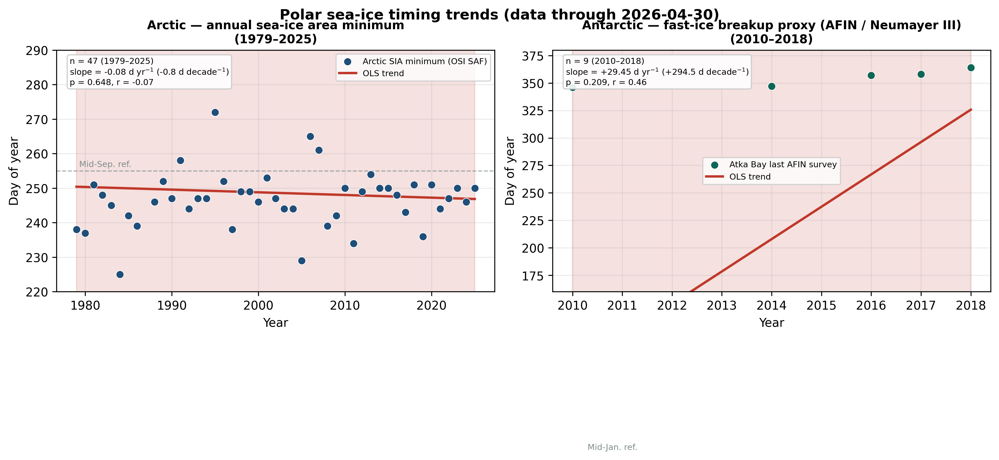
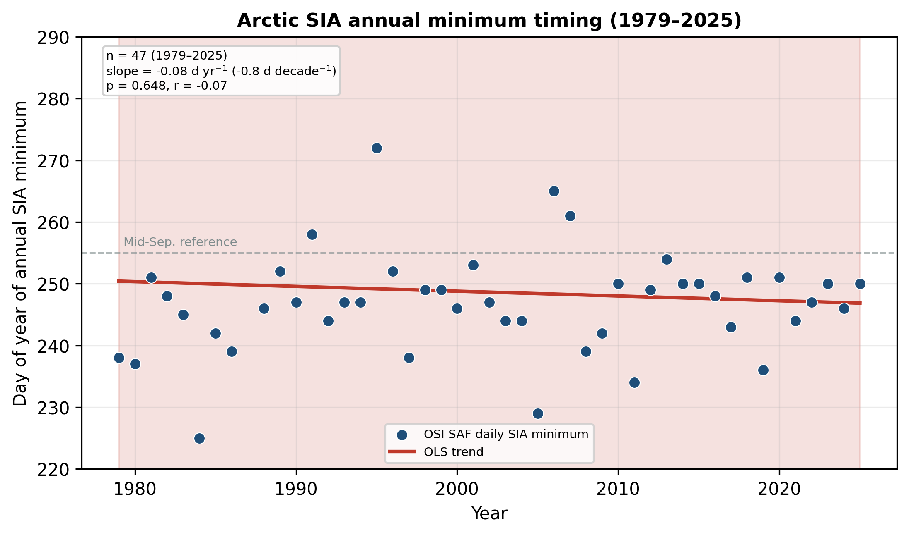
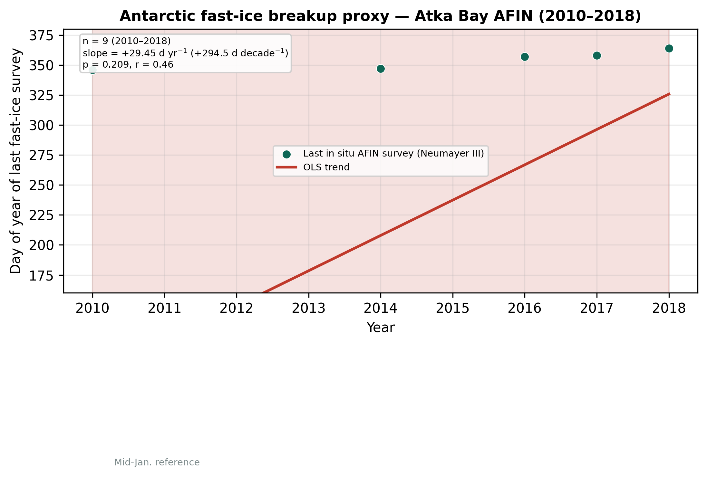

# Results (auto-generated)

> **April 2026** | Data cutoff: **2026-04-30**

## Combined finding

Neither **Arctic** pan-hemispheric minimum timing nor **Antarctic** Atka Bay fast-ice breakup timing shows a **statistically significant** linear trend at the 5% level through April 2026. Ice **amount** continues to decline in the Arctic; local fast ice in Atka Bay shows strong **interannual variability** (AFIN / Neumayer III).



---

## Arctic — sea-ice area annual minimum (OSI SAF)

### Arctic SIA minimum DOY

| Statistic | Value |
|-----------|-------|
| Period | 1979–2025 (*n* = 47) |
| Mean DOY | 248.6 (σ = 15.5) |
| OLS slope | -0.077 days yr⁻¹ (-0.8 days decade⁻¹) |
| 95% bootstrap CI | [-0.487, 0.194] days yr⁻¹ |
| *p*-value | 0.6480 |
| Significant (α = 0.05)? | No |
| Direction | earlier |


**Interpretation:** September minimum **extent/area** has fallen sharply since 1979, but the calendar date of the minimum remains variable (early–late September). No robust shift in timing (*p* = 0.648).

NSIDC extent sensitivity: slope +0.072 days yr⁻¹, *p* = 0.2045.



---

## Antarctic — fast-ice breakup proxy (AFIN / Neumayer III / Atka Bay)

**Method:** Last in situ AFIN transect survey date each austral season (2010–2018, PANGAEA).  
**Context:** Neumayer Station III overwintering team; **SPOT** penguin observatory monitors emperor penguins on adjacent fast ice.

### Last AFIN survey DOY (breakup proxy)

| Statistic | Value |
|-----------|-------|
| Period | 2010–2018 (*n* = 9) |
| Mean DOY | 207.9 (σ = 173.9) |
| OLS slope | +29.450 days yr⁻¹ (+294.5 days decade⁻¹) |
| 95% bootstrap CI | [-11.599, 71.488] days yr⁻¹ |
| *p*-value | 0.2086 |
| Significant (α = 0.05)? | No |
| Direction | later |


**Interpretation:** Breakup/survey-end dates range from late austral spring to mid-summer (DOY ~160–380). Arndt et al. (2020) report strong interannual variability (e.g. iceberg blocking in 2013, 2016) without a multi-year thickness trend over 2010–2018. Our timing trend over the same period is also **not significant** (*p* = 0.209).



---

## Data tables

| File | Content |
|------|---------|
| `results/tables/arctic_annual_minimum_doy_osisaf_sia.csv` | Arctic minimum DOY |
| `results/tables/antarctic_annual_breakup_doy_afin.csv` | Antarctic breakup proxy |
| `results/tables/antarctic_afin_all_surveys.csv` | All AFIN survey records |

## Reproduce

```bash
python scripts/download_data.py
python scripts/run_analysis.py
```
