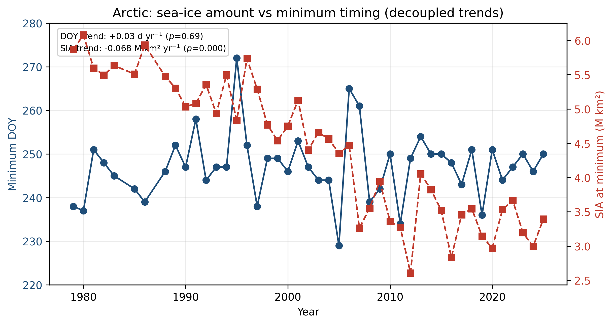
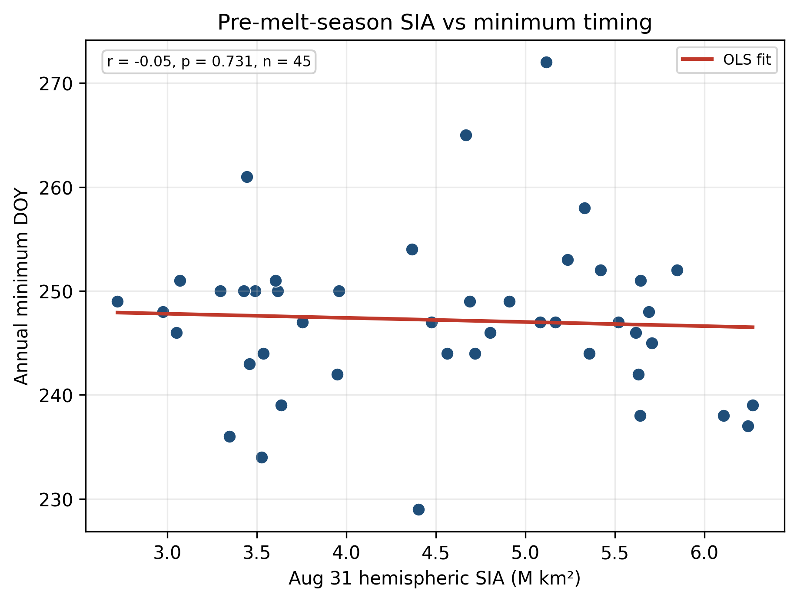
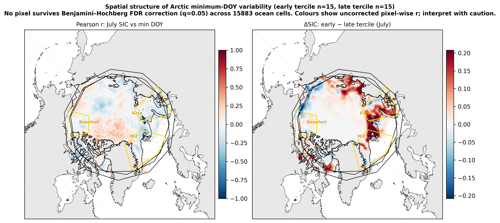
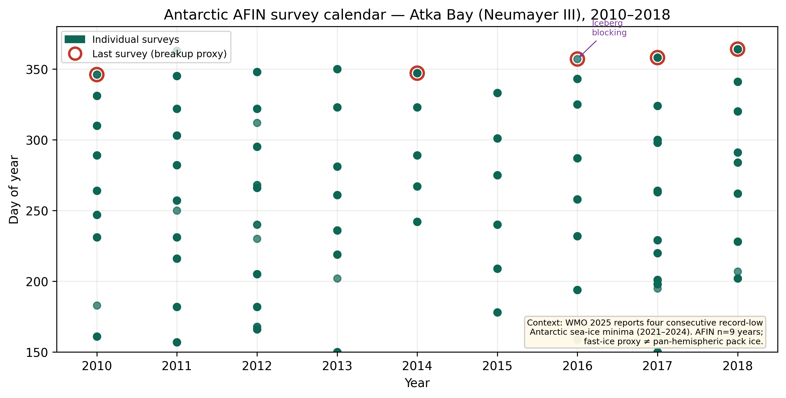

# LaTeX reports & slides

All figure paths are relative to this folder: `../results/figures/`.

PDFs are **not** committed (see root `.gitignore`). Compile locally after running the analysis pipelines.

---

## Files

| File | Output PDF | Description |
|------|------------|-------------|
| `one_pager.tex` | `one_pager.pdf` | Phase 1 course submission (auto-generated from `results/summary.json`) |
| `full_report.tex` | `full_report.pdf` | Full write-up: Phase 1 trends + Phase 2 spatial null test (~5 figures) |
| `slides.tex` | `slides.pdf` | Beamer presentation (~7 slides, 16:9) |

---

## Prerequisites

[TeX Live](https://www.tug.org/texlive/) or [MacTeX](https://www.tug.org/mactex/), with `pdflatex` and standard packages (`graphicx`, `hyperref`, `beamer`, etc.).

Generate figures first:

```bash
# From project root
python scripts/run_analysis.py   # Phase 1 figures
make phase2                        # Phase 2 figures (Figs 2–5, Antarctic calendar)
```

---

## Compile

From project root:

```bash
make pdf      # one_pager.pdf only
make report   # full_report.pdf + slides.pdf
```

Or manually from this directory:

```bash
cd report

# One-pager (Phase 1)
pdflatex -interaction=nonstopmode one_pager.tex
pdflatex -interaction=nonstopmode one_pager.tex

# Full report (Phase 1 + 2)
pdflatex -interaction=nonstopmode full_report.tex
pdflatex -interaction=nonstopmode full_report.tex

# Slides
pdflatex -interaction=nonstopmode slides.tex
pdflatex -interaction=nonstopmode slides.tex
```

---

## Full report — figure list

| Fig | File | Content |
|-----|------|---------|
| 1 | `polar_ice_timing_comparison.png` | Phase 1 Arctic + Antarctic timing trends |
| 2 | `arctic_sia_minimum_vs_doy_dual_axis.png` | SIA at minimum vs. min DOY (decoupling) |
| 3 | `arctic_aug31_sia_vs_min_doy.png` | Aug 31 SIA vs. min DOY scatter |
| 5 | `fig5_spatial_heatmap.png` | Pearson-r map + early/late tercile ΔSIC composite |
| 4 | `antarctic_afin_calendar.png` | AFIN survey calendar + WMO context |

### Preview (compile locally for PDF; figures render on GitHub from repo)

**Fig 1 — Phase 1**


**Fig 2 — Amount ≠ timing**



**Fig 3 — Aug 31 scatter**



**Fig 5 — Spatial null test**



**Fig 4 — Antarctic context**



---

## Slides — outline

| Slide | Content |
|-------|---------|
| 1 | Title |
| 2 | Core finding (locked): magnitude loss ≠ calendar shift |
| 3 | Phase 1: no significant timing shift |
| 4 | Amount ≠ timing (Fig 2) |
| 5 | Phase 2: spatial hypothesis + FDR null result (Fig 5) |
| 6 | Why the null result matters (literature context) |
| 7 | Antarctic context (Fig 4) |
| 8 | Conclusion + future work (ERA5 winds) |

---

## Before submitting

1. Set `project.author` in `config.yaml`
2. Run `python scripts/run_analysis.py` and `make phase2`
3. Compile: `make report` (or `make pdf` for one-pager only)
4. Submit `one_pager.pdf` (Phase 1) and/or `full_report.pdf` + `slides.pdf` (course extension)
